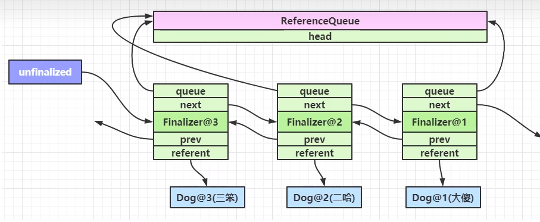
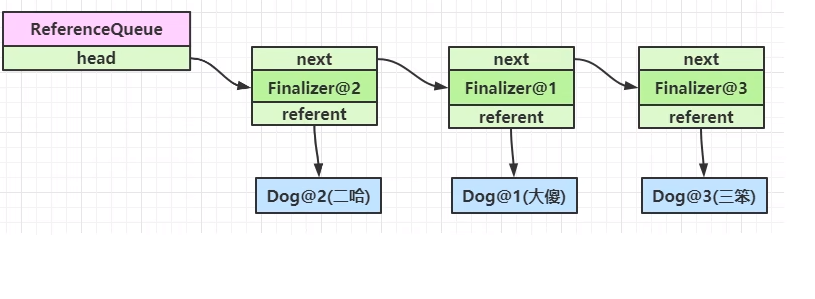

# JVM

## 类加载过程

分为三个阶段

1. 加载
   1. 将类的字节码载入方法区，并创建类.class 对象（位于堆中）
   2. 如果此类的父类没有加载，先加载父类
   3. 加载是懒惰执行的
2. 链接
   1. 验证 - 验证类是否符合 Class 规范，合法性、安全性检查
   2. 准备 - 为 static 变量分配空间，设置默认值
   3. 解析 - 将常量池的符号引用解析为直接引用
3. 初始化
   1. 执行静态代码块与非 final 静态基本类型的变量的赋值
   2. 初始化是懒惰执行

## 自己编写类加载器能不能加载一个假冒的 java.lang.System ？

不行

- 假设自己的类加载器用双亲委派，那么优先由启动类加载器加载真正的 java.lang.System，自然不会加载假冒的
- 假设自己的类加载器不用双亲委派，那么类加载器加载假冒的 java.lang.System 时，需要先加载它的分类 java.lang.Object，而因为没有双亲委派，找不到 java.lang.Object 所以失败
- 实际操作时会发现自定义类加载器加载以 java. 打头的类时，会抛出安全异常，jdk 9 以上这些特殊包名都与模块进行了绑定，更连编译也过不了

双亲委派的目的有两点：

1. 让上级类加载器中的类对下级共享（反之不行），即能让你的类依赖到 jdk 提供的核心类
2. 让类的加载有优先顺序，保证核心类的优先加载

## 对象引用类型分为哪几类

1. 强引用
   1. 普通变量赋值即为强引用，如 A a = new A ();
   2. 通过 GC ROOT 的引用链，如果强引用不到该对象，该对象才能被回收

2. 软引用（SoftReference）
   1. 例如 SoftReference a = new SoftReference(new A());
   2. 如果仅有软引用对象时，首次垃圾回收不会回收该对象，如果内存仍不足，再次回收时才会释放对象
   3. 软引用自身需要配合引用队列来释放
   4. 典型例子是反射数据

3. 弱引用 （WeakReference）
   1. 例如 WeakReference a = new WeakReference(new A());
   2. 如果仅有弱引用引用该对象，只要发生垃圾回收，就会释放对象
   3. 弱引用自身需要配合引用队列来释放
   4. 典型例子就是 ThreadLocalMap 中的 Entry 对象创建

4. 虚引用（PhantomReference）
   1. 例如 PhantomReference a = new PhantomReference(new A());
   2. 必须配合引用队列一起使用，当虚引用引用的对象被回收时，会将虚引用对象入队，由 Reference Handler 线程释放其关联的外部资源
   3. 典型例子是 Cleaner 释放 DirectByteBuffer 占用的直接内存

## 两个重要队列 unfinalized 队列、ReferenceQueue 队列

- unfinalized 队列：当重写了 finalize 方法的对象，在构造方法调用之时，JVM 都会将其包装成一个 Finalizer 对象，并加入 unfinalized 队列中（静态成员变量、双向链表结构）
  
    

- ReferenceQueue 队列：也是 Finalizer 类中一个静态成员变量，名为 queue（单向链表），当对象在执行完 finalize() 可以当作垃圾回收时，会将该对象对应的 Finalizer 对象加入这个队列
  
    

## finalize 的理解，为什么 finalize 方法非常不好，非常影响性能

finalize 时 Object 中的一个方法，子类重写它，垃圾回收时此方法会被调用，可以在其进行一些资源释放和清理工作

但是将资源释放和清理放在 finalize 方法中非常不好，并且影响性能，严重时会引起 OOM，从 jdk 9 开始就被放弃了，不建议使用

- 非常不好
  1. FinalizerThread 是守护线程，代码很有可能没来得及执行完，线程就结束了，造成资源没有正确释放
  2. 异常会被吞掉，无法判断有没有在释放资源时发生错误
- 影响性能
  1. 重写了 finalize 方法的对象在第一次被 GC 时无法被释放，因为需要等 FinalizerThread 调用完 finalize，把它从第一个 unfinalized 队列移除后，没有被引用时第二次GC 才能被释放
  2. GC 本就因为内存不足引起，finalize 调用又很慢（两个队列的移除操作，且都是串行执行的），不能及时释放内存，对象释放不及时就会逐渐移入老年代，老年代垃圾积累过多就会容易 Full GC，Full GC 释放速度如果仍跟不上创建新对象的速度就会 OOM

