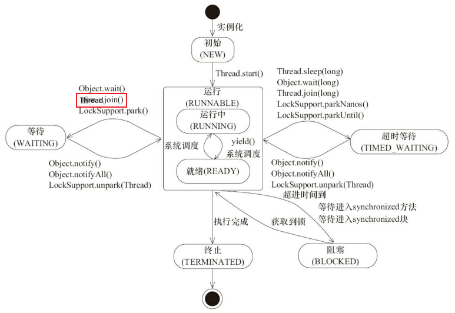

# 多线程与并发

## 多线程理解

什么是多线程：多线程指的是在单个程序之中可以同时运行多个线程来执行不同的任务
优点：

- 提高 CPU 资源的利用率
- 提高程序的响应

使用场景：

- 后台任务，例如：定时向大量(100w以上)的用户发送邮件
- 异步处理，例如：发微博哦，记录日志等
- 分布式计算
- tomcat，多个客户端访问一个 web 服务器，把每个请求交给一个 servlet 处理

## Java 内存模型(JMM)

定义: 只是一个抽象的规范，避免不同硬件和操作系统下对内存访问逻辑有所差异带来同一套代码执行不同结果的问题

JMM 关于同步的规定：

1. 线程**解锁**前，必须把共享变量的值重新刷新回主内存当中
2. 线程**加锁**前，必须将主内存中的最新值读到工作内存中
3. 加锁、解锁是同一把锁

JMM 对内存的划分

分为主内存和工作内存

规定变量存储于主内存中，每个线程都有自己的工作内存，线程中保存了自己需要操作的变量的主内存的拷贝副本，对其进行操作后再刷回主内存

每个线程工作内存是独立的，线程操作数组只能在工作内存中进行，再刷回主内存，所以线程通信依靠主内存

Java 线程 <----------> 工作内存 <----------> 主内存

## 说说线程的生命周期和状态

  

## 什么是线程死锁？如何避免死锁？

定义：线程死锁描述的是这样一种情况：多种线程同时被阻塞，它们中的一个或全部都在等待某个资源被释放，由于线程被无限地阻塞，因此程序不可能正常终止

如线程 A 持有资源 1，线程 B 持有资源 2，它们同时都想申请对方的资源，所以这两个线程就会互相等待进入死锁状态

如何避免死锁：

- 避免一个线程同时获取多个锁
- 避免一个线程在锁内同时占用多个资源，尽量保证每个锁只占用一个资源
- 尝试使用带超时的锁，如 lock.tryLock(timeout) 来替代使用内部锁机制
- 对于数据库锁，加锁和解锁必须在一个数据库连接里，否则会出现解锁失败的情况

## 说说 sleep() 方法和 wait() 方法的区别和共同点

- 两者最主要的区别在于：sleep() 方法没有释放锁，而 wait() 方法释放了锁
- 两者都可以暂停线程的执行
- wait() 通常用于线程间交互/通信，sleep() 通常被用于暂停执行
- wait() 方法被调用后，线程不会自动苏醒，需要别的线程调用同一个对象上的 notify() 或者 notifyAll() 方法，或者使用 wait(timeout) 超时后线程会自动苏醒。sleep() 方法执行完成后，线程会自动苏醒

## 无锁、偏向锁、轻量级锁、重量级锁

这四种锁专门针对 synchronized

Lock Recor：其包括一个用于存储对象头中的 mark word（官方称之为Displaced Mark Word）以及一个指向对象的指针(Object reference)

### 无锁

 无锁对资源不进行锁定，所有线程都能访问并修改同一个资源，但同时只有一个线程能修改成功。

 特点是修改操作在循环内进行，线程会不断的尝试修改共享资源，直到修改成功。CAS即无锁的实现。无锁无法全面替代有锁，但在某些场合下无锁的性能非常高

### 偏向锁

引入偏向锁是为了提高一个对象在一段很长的时间内都只被一个线程用做锁对象场景下的加锁解锁性能

在第一次获取锁时，会有一个CAS操作，之后该线程再次获取锁，只会执行几个简单的命令，而不是开销相对较大的CAS命令

- 对象创建

JVM 1.6 以上默认开启偏向锁，当新创建一个对象的时候，如果该对象所属的 class 没有关闭偏向锁模式，那么新创建的对象的 mark word 将是可偏向的，此时 mark word 中
的 thread id 为 0，表示未偏向任何线程，即匿名偏向

- 加锁过程

case1：当该对象第一次被线程获得锁的时候，发现是匿名偏向状态，则会用 CAS 指令，将 mark word 中的 thread id 由 0 改为 当前线程的 id。如果成功，则代表获得了偏向锁，继续执行同步块中的代码，否则，将偏向锁撤销，升级为轻量级锁

case2：当被偏向的线程再次获取锁时，发现锁对象偏向的线程是自己，会往当前线程的栈中添加一个 Displaced Mark Word 为 null 的 Lock Record，然后继续执行同步块的代码

case3：当其他线程进入同步块时，发现已经有偏向锁的线程了，则会进入撤销偏向锁的逻辑，会在 safepoint (所有线程都处于暂停状态)中查看偏向的线程是否存活，如果存活且还在同步块中则将偏向锁升级为轻量级锁，原偏向的线程继续拥有锁，当前线程则走锁升级；如果偏向的线程已经不存活或者不在同步块中，则将对象头的 mark word 改为 无锁状态，之后再升级为轻量级锁

- 解锁过程

其他线程尝试获取锁时，是根据遍历偏向线程的 Lock Record 来确定该线程是否还在执行同步块的代码。因此解锁时仅仅将栈中最近的一条的 Lock Record 的 obj 置为 null，即不再指向偏向线程的锁对象，偏向锁的解锁不会修改对象头中的 thread id

- 批量重偏向和撤销

其做法是：以class为单位，为每个class维护一个偏向锁撤销计数器，每一次该class的对象发生偏向撤销操作时，该计数器+1，当这个值达到重偏向阈值（默认20）时，JVM就认为该class的偏向锁有问题，因此会进行批量重偏向。每个class对象会有一个对应的epoch字段，每个处于偏向锁状态对象的mark word中也有该字段，其初始值为创建该对象时，class中的epoch的值。每次发生批量重偏向时，就将该值+1，同时遍历JVM中所有线程的栈，找到该class所有正处于加锁状态的偏向锁，将其epoch字段改为新值。下次获得锁时，发现当前对象的epoch值和class的epoch不相等，那就算当前已经偏向了其他线程，也不会执行撤销操作，而是直接通过CAS操作将其mark word的Thread Id 改成当前线程Id。

当达到重偏向阈值后，假设该class计数器继续增长，当其达到批量撤销的阈值后（默认40），JVM就认为该class的使用场景存在多线程竞争，会标记该class为不可偏向，之后，对于该class的锁，直接走轻量级锁的逻辑。

### 轻量级锁

很多情况下，同步块中的代码不存在竞争，而是不同的线程交替执行同步块中的代码。这种情况下，用重量级锁是没必要的，因此引入轻量级锁。

轻量级锁是指在线程在获取锁时，锁对象处于偏向模式且偏向的线程还在使用锁，就会将锁的 mark word 改为轻量级锁的状态。

- 加锁流程：

- 在线程栈中创建一个 Lock Record，将其 obj 字段指向锁对象
- CAS 将锁对象头中的 Mark Word 替换为指向 Lock Record 的指针，如果对象处于无锁状态则修改成功，代表该线程获得了轻量级锁。如果失败，进入下一步
- 如果是当前线程已经持有该锁，代表这是一次锁重入。设置 Lock Record 的第一部分(Displaced Mark Word) 为 null，起一个重入计数器的作用，然后结束
- 走到这一步说明发生了竞争，需要膨胀为重量级锁。

- 解锁过程

1. 遍历线程栈找到该锁对象的所有 Lock Record
2. 如果 Lock Record 的 Displaced Mark Word 为 null，代表这是一次锁重入，将 obj 置为 null 后 continue
3. 如果 Lock Record 的 Displaced Mark Word 不为 null，则利用CAS指令将对象的 mark word 恢复为 Displaced Mark Word。如果成功则 continue，否则进行了锁膨胀或已经升级为重量级锁，进入重量级锁解锁流程

### 重量级锁

重量级锁的状态下，对象的 mark word 为指向一个堆中的 monitor 对象的指针

一个 monitor 对象包括 cxq、EntryList、WaitSet、owner。

在重量级锁加锁之前，先要进行锁膨胀来获取 monitor 对象。

- 锁膨胀：

1. 对 mark word 的状态进行判断
2. 如果已经是重量级状态，说明膨胀完成，直接返回
3. 如果是膨胀中的状态，说明另一个线程正在进行锁膨胀，continue 重试
4. 如果是轻量级锁的状态，则进入膨胀
   - 构建一个 monitor 对象
   - 设置 monitor 对象的 owner 字段为 Lock Record, obj 字段为锁对象
   - 设置 锁对象头中的 mark word 为重量级锁状态，指向 monitor 对象
5. 如果是无锁状态，同样进行膨胀
   - 构建一个 monitor 对象
   - 设置 monitor 对象的 owner 字段为 null, obj 字段为锁对象
   - 设置 锁对象头中的 mark word 为重量级锁状态，指向 monitor 对象
6. 膨胀完成返回 monitord 对象

- 加锁过程
  
初步尝试获取：

1. 尝试 CAS 修改 owner 字段为当前线程，成功则获取锁，否则进行下一步判断
2. 如果 owner 为自己，则认为是锁重入，将重入次数 +1，成功获取锁
3. 如果 owner 为当前线程的 Lock Record，说明当前线程是之前轻量级锁的持有者，将重入次数置为 1，owner 改为当前线程，成功获取锁
4. 以上条件都不满足进入再次尝试获取锁的逻辑

再次尝试获取锁：

1. 先进行一次 CAS 尝试加锁，成功则返回
2. 尝试自旋加锁，成功则返回
3. 多次尝试加锁失败后将线程加入阻塞队列 cxq 中
4. 再次尝试加锁，失败后将自己挂起
5. 被唤醒后继续尝试加锁，如果成功，将节点从 cxq 或者 EntryList 中移除，否则继续尝试
